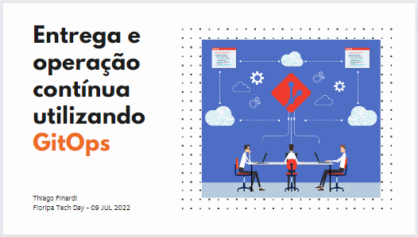

# Floripa Tech Day - 2022

Este repositório contém os manifestos utilizados na apresentação.

## Apresentação:

| Path | Application | Description |
|------|-------------|-------------|
| [app](app-of-apps/) | App of Apps | Manifesto principal que contempla todos os demais recursos/manifestos que serão aplicados no cluster |
| [conf](conf/) | Apps Manifests | Definição dos manifestos que serão utilizados pelo App of Apps |
| [ingress-nginx](nginx-ingress/) | NGINX Ingress | Manifesto para instalação do NGINX ingress controller |

## Requisitos:

- Um cluster [Kubernetes](https://kubernetes.io/) local ou na núvem.
- Instalar o [ArgoCD](https://argo-cd.readthedocs.io/en/stable/) no cluster.
