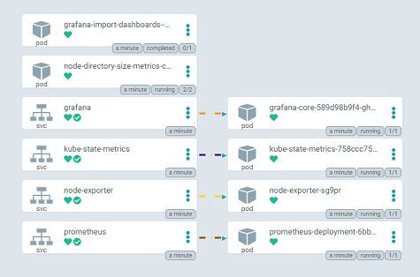

# Floripa Tech Day - 2022

Este repositório contém os manifestos utilizados na apresentação.

## Apresentação:

[](https://www.canva.com/design/DAFFjQG1wDs/CDrxfeVx9TZ9wsDPdU2Ofw/view)


| Path | Application | Description |
|------|-------------|-------------|
| [app](app-of-apps/) | App of Apps | Manifesto principal que contempla todos os demais recursos/manifestos que serão aplicados no cluster |
| [conf](conf/) | Apps Manifests | Definição dos manifestos que serão utilizados pelo App of Apps |
| [ingress-nginx](nginx-ingress/) | NGINX Ingress | Manifesto para instalação do NGINX ingress controller |


## Requisitos:

- Um cluster [Kubernetes](https://kubernetes.io/) local ou na núvem.
- Instalar o [ArgoCD](https://argo-cd.readthedocs.io/en/stable/) no cluster.


### Instalar o ArgoCD no K8s

```bash
kubectl create namespace argocd
kubectl apply -n argocd -f https://raw.githubusercontent.com/argoproj/argo-cd/stable/manifests/install.yaml
```

### Acessar a interface do ArgoCD

```bash
kubectl get svc -n argocd
kubectl port-forward svc/argocd-server 8080:443 -n argocd
```

### Logar como `admin` no ArgoCD com o Token gerado na instalação

```bash
kubectl -n argocd get secret argocd-initial-admin-secret -o jsonpath="{.data.password}" | base64 --decode && echo
```

### Aplicar o manifesto do App of Apps

```bash
kubectl apply -f app/app-of-apps.yaml
```

## Recursos após aplicar o manifesto do App of Apps


### App of Apps Dashboard


### App of Apps Resources


### NGINX Ingress Resources


### Sock Shop Resources


### Monitoring Resources




### Links

* Install ArgoCD: [https://argo-cd.readthedocs.io/en/stable/getting_started/#1-install-argo-cd](https://argo-cd.readthedocs.io/en/stable/getting_started/#1-install-argo-cd)
* Login to ArgoCD: [https://argo-cd.readthedocs.io/en/stable/getting_started/#4-login-using-the-cli](https://argo-cd.readthedocs.io/en/stable/getting_started/#4-login-using-the-cli)
* ArgoCD Configuration: [https://argo-cd.readthedocs.io/en/stable/operator-manual/declarative-setup/](https://argo-cd.readthedocs.io/en/stable/operator-manual/declarative-setup/)
* ArgoCD Application Config: [https://github.com/tfinardi/argocd-demo/argo-app-conf/](https://github.com/tfinardi/argocd-demo/argo-app-conf/)
* WeaveWorks Microservices Demo Application: [https://github.com/microservices-demo/microservices-demo/tree/master/deploy/kubernetes](https://github.com/microservices-demo/microservices-demo/tree/master/deploy/kubernetes)
* Monitoring Stack: [https://github.com/microservices-demo/microservices-demo/tree/master/deploy/kubernetes/manifests-monitoring](https://github.com/microservices-demo/microservices-demo/tree/master/deploy/kubernetes/manifests-monitoring)
* Ingress Nginx: [https://kubernetes.github.io/ingress-nginx](https://kubernetes.github.io/ingress-nginx)
